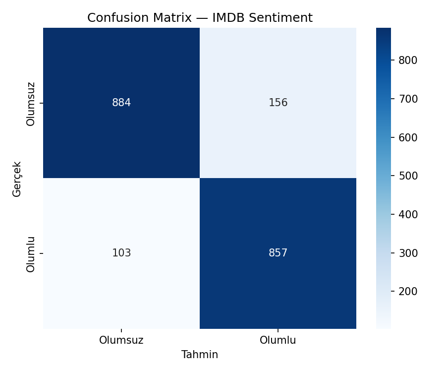
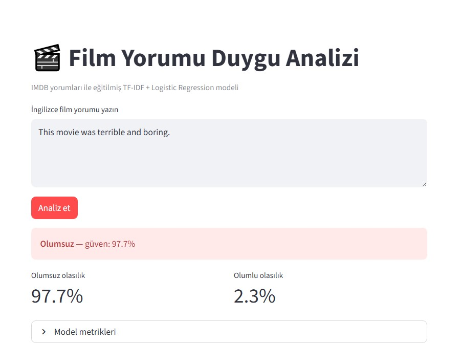

# Movie Sentiment NLP

IMDB film yorumlarını **olumlu / olumsuz** olarak sınıflandıran klasik NLP projesi.  
Portföy hedefi: veri yükleme → ön işleme → model → metrik → canlı demo (Streamlit).

## Problem

Kullanıcıların yazdığı **İngilizce film yorumunun** duygusunu otomatik tahmin etmek: olumlu (1) veya olumsuz (0).

## Teknolojiler

| Alan | Araç |
|------|------|
| Veri | [Hugging Face IMDB](https://huggingface.co/datasets/imdb) |
| Ön işleme | NLTK (HTML temizleme, stopword, lemmatization) |
| Model | TF-IDF (1–2 gram) + Logistic Regression |
| Pipeline | scikit-learn `Pipeline` |
| Deploy | Streamlit |

## Model sonuçları

10.000 eğitim + 2.000 test örneği ile eğitildi.

| Metrik | Validation | Test |
|--------|------------|------|
| **Accuracy** | 87.1% | **87.1%** |
| **Precision** | 85.4% | 84.6% |
| **Recall** | 89.1% | 89.3% |
| **F1-score** | 0.87 | **0.87** |

Validation ve test skorları birbirine yakın → aşırı ezberleme belirtisi zayıf.

### Confusion matrix (test seti)



| | Tahmin: Olumsuz | Tahmin: Olumlu |
|--|-----------------|----------------|
| **Gerçek: Olumsuz** | 884 | 156 |
| **Gerçek: Olumlu** | 103 | 857 |

## Canlı demo (Streamlit)

```bash
streamlit run app.py
```

Örnek tahmin: *"This movie was terrible and boring."* → **Olumsuz** (%97.7 güven)



## Örnek tahminler (CLI)

```bash
python -m src.predict "This movie was terrible and boring."
# Duygu: Olumsuz (güven: 97.74%)

python -m src.predict "Amazing film, best acting ever!"
# Duygu: Olumlu (güven: 77.96%)
```

## Proje yapısı

```
movie-sentiment-nlp/
├── assets/
│   └── streamlit-demo.jpg   # Streamlit ekran görüntüsü
├── src/
│   ├── config.py
│   ├── load_data.py       # IMDB indirme
│   ├── preprocess.py      # metin temizleme
│   ├── train_model.py     # eğitim + grafikler
│   └── predict.py         # tek yorum tahmini
├── app.py                 # Streamlit arayüzü
├── reports/
│   ├── metrics.json
│   └── confusion_matrix.png
├── models/                # sentiment_pipeline.joblib (eğitim sonrası)
└── requirements.txt
```

## Kurulum

```bash
cd movie-sentiment-nlp
python -m venv venv
venv\Scripts\activate          # Windows
pip install -r requirements.txt
```

## Eğitim

İlk çalıştırmada IMDB veri seti indirilir (internet gerekir).

```bash
python -m src.train_model
```

Tam veri seti için `src/config.py`:

```python
TRAIN_SAMPLE_SIZE = None
TEST_SAMPLE_SIZE = None
```

**Çıktılar:**

- `models/sentiment_pipeline.joblib`
- `reports/metrics.json`
- `reports/confusion_matrix.png`

> Model dosyası büyük olduğu için GitHub’a yüklenmeyebilir. Repoyu klonlayanlar `python -m src.train_model` ile modeli yeniden üretebilir.

## Ne öğrendim?

- Metin sınıflandırma pipeline'ı (sklearn `Pipeline`)
- TF-IDF ve n-gram özellikleri
- `class_weight='balanced'` ile sınıf dengesi
- Train / validation / test ayrımı, F1 ve confusion matrix
- Modeli `joblib` ile kaydedip Streamlit'te kullanma

## Sonraki adım

- Aynı veri setinde **DistilBERT** fine-tuning
- Klasik ML vs transformer metrik karşılaştırması

## Lisans

Eğitim / portföy amaçlı — IMDB veri seti Hugging Face üzerinden kullanılır.
